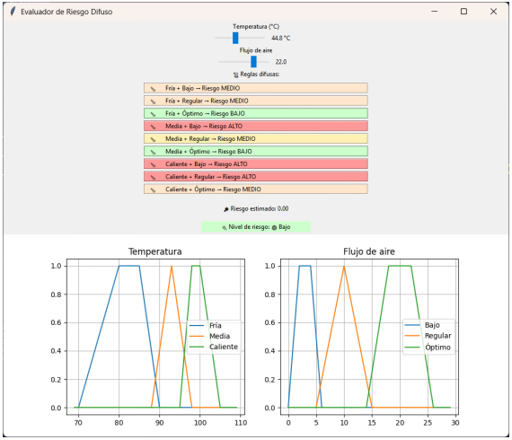
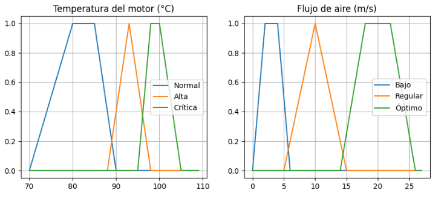
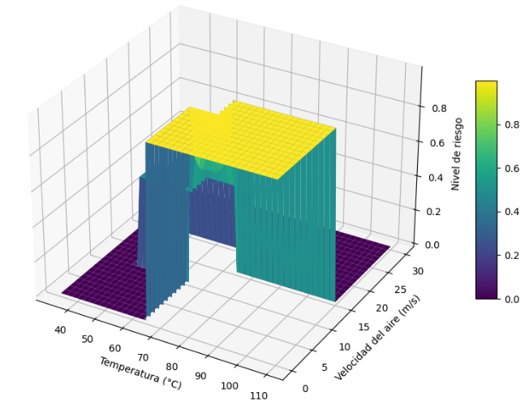

🚗🔥 Sistema Predictivo Basado en Lógica Difusa para la Prevención del Sobrecalentamiento
Presentado en el Congreso Internacional de Mantenimiento y Confiabilidad (CIMCYT 2025)

---

## 🎯 Resumen del proyecto

Este proyecto desarrolla un sistema inteligente para la prevención del sobrecalentamiento en motores de combustión interna. A diferencia de los sistemas de monitoreo tradicionales, que son **reactivos** (alertan cuando el motor *ya* está sobrecalentado), esta solución es **predictiva**.

🔍 Utiliza sensores de temperatura (DS18B20) y flujo de aire (anemómetro), junto con un **sistema de inferencia difuso Takagi-Sugeno**, para anticipar condiciones de riesgo antes de que ocurran fallos críticos.

🧩 El núcleo del prototipo está implementado en un microcontrolador **NodeMCU (ESP8266)** y envía alertas a una **aplicación móvil** desarrollada en App Inventor.

📁 Este repositorio contiene el código fuente del simulador de escritorio en Python, así como la documentación de la investigación.

---

## ✨ Características clave

- 🧠 **Modelo Predictivo:** Utiliza lógica difusa (Takagi-Sugeno) para *predecir* el riesgo de sobrecalentamiento, no solo para reaccionar a él.  
- 🌡️ **Entradas Múltiples:** Procesa datos de dos variables críticas: temperatura del refrigerante y flujo de aire del ventilador.  
- 📱 **Ecosistema Completo:** El proyecto está diseñado en 3 componentes:  
  1. 🔧 **Hardware:** Prototipo con NodeMCU y sensores.  
  2. 📲 **App Móvil:** Aplicación en App Inventor para recibir alertas.  
  3. 💻 **Simulador:** Script en Python para probar el modelo.  
- 📊 **Simulador Interactivo:** GUI en Python (Tkinter) para visualizar funciones de membresía y probar el sistema de inferencia en tiempo real.

---

## 🛠️ Tecnologías utilizadas

| Componente        | Tecnología / Herramienta                      |
|-------------------|----------------------------------------------|
| 💻 Simulador      | Python + `matplotlib`, `tkinter`             |
| 🔧 Hardware       | NodeMCU (ESP8266)                             |
| 🌡️ Sensores       | DS18B20 (Temperatura), Anemómetro            |
| 📲 App Móvil      | MIT App Inventor                              |
| 🧠 Modelo Difuso   | Lógica Difusa (Takagi-Sugeno)                |

---

---

---

📸 Galería del Proyecto
Visualizaciones clave del sistema desarrollado

   
  <em>Interfaz gráfica del simulador (Tkinter) para probar el sistema de inferencia.</em>

   
  <em>Funciones de membresía (Temperatura y Flujo de Aire) usadas en el modelo difuso.</em>

   
  <em>Superficie 3D del sistema Takagi-Sugeno que muestra el nivel de riesgo.</em>

   
  <em>Interfaz de la App Móvil (App Inventor) para recibir alertas.</em>

---

## 🧑‍🔬 Autores y agradecimientos

Este proyecto es el resultado de la investigación presentada en el Congreso Internacional de Mantenimiento y Confiabilidad (CIMCYT 2025).  
Agradecimientos a todos los colaboradores que hicieron posible esta propuesta.

---

## ⚖️ Licencia

Este proyecto está distribuido bajo la Licencia MIT. Consulta el archivo `LICENSE` para más detalles.
